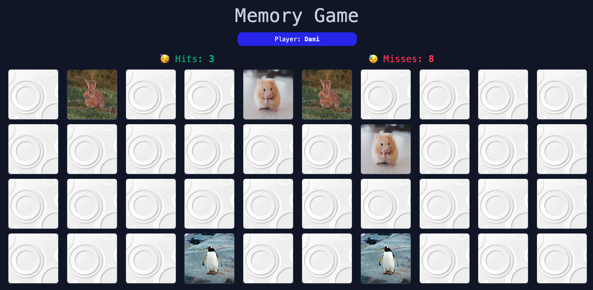

# Memory Card Game

This is a simple memory game built with React and tailwindcss. Displays a deck of cards that the user can flip over and match. The object of the game is to find all the pairs of cards in as few mistakes as possible.


## Tech Stack

**Client:** React, Redux, TailwindCSS


## Screenshots




## Installation

To test the project on your local computer, follow these steps:

Clone this repository to your local computer using git clone
```bash
  git clone https://github.com/danburitica/memory-game.git
```

Navigate to the project directory using cd memory-card-game
```bash
  cd memory-game
```

Install memory-game dependencies with npm
```bash
  npm install
```

Run npm run dev to start the development server. Open http://127.0.0.1:5173/ in your browser to see the game.
```bash
  npm run dev
```
## Deployment

This project is deployed in **Vercel App**:

Click on "New Project".
Click on "Import Git Repository" and select the GitHub repository.
Configure deployment options.
Click on "Deploy" to deploy the project.


## Demo

https://memory-game-six-ashy.vercel.app/
